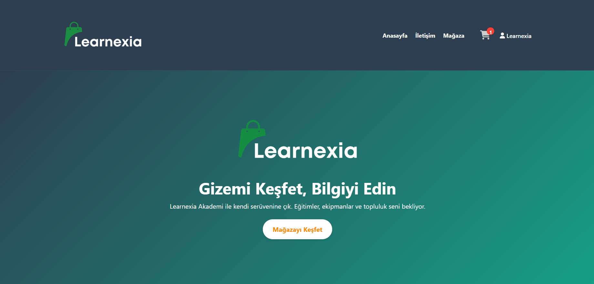
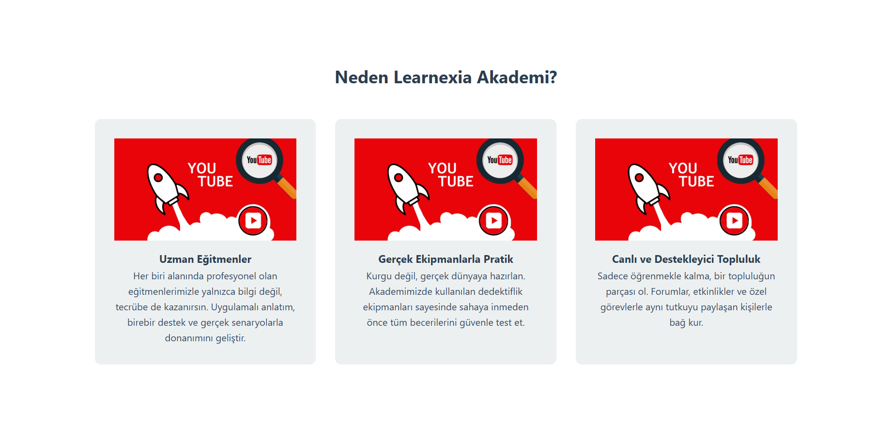
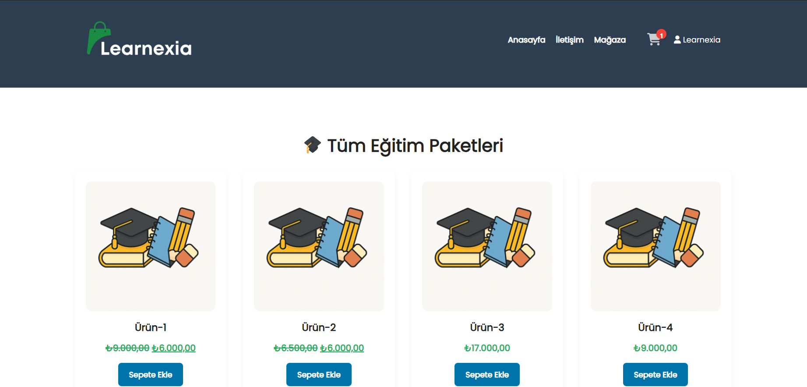
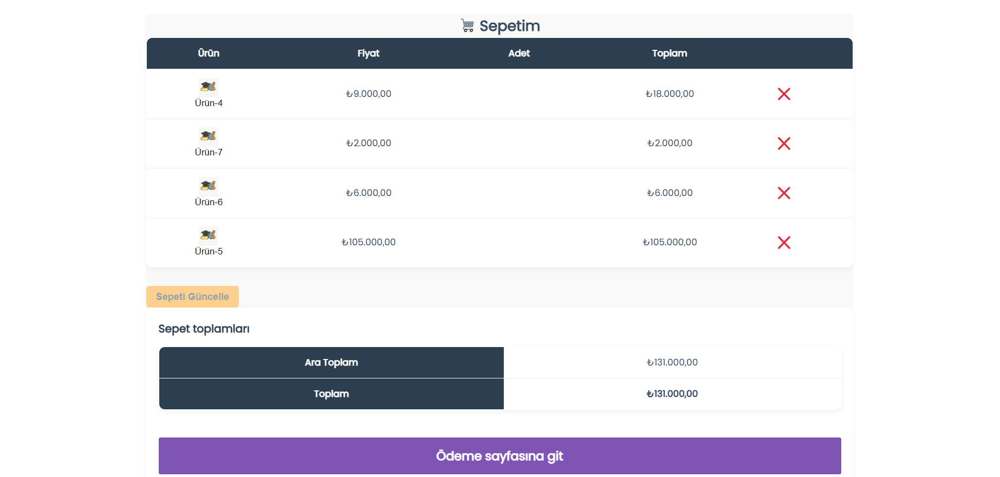
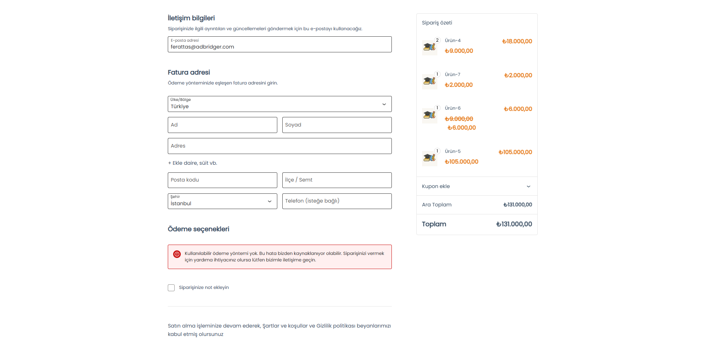
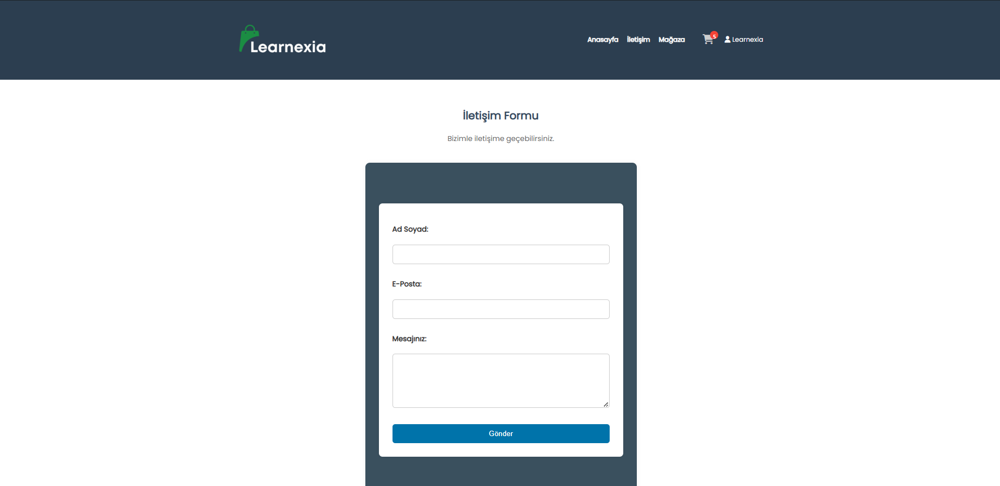

# 🕵️ Learnexia WordPress Teması

**Learnexia**, eğitim odaklı dijital içeriklerin sunumu ve satışı için geliştirilmiş modern, hafif ve tam özelleştirilebilir bir **WordPress + WooCommerce temasıdır**. Eğitmenler, online akademiler ve dijital eğitim girişimleri için özel olarak tasarlanmıştır.

---

## 🌟 Temaya Genel Bakış

| Alan           | Açıklama                                         |
| -------------- | ------------------------------------------------ |
| 🎨 Tema Adı    | Learnexia Theme                                  |
| ⚖️ Platform    | WordPress 6+, WooCommerce 7+                     |
| 🎯 Hedef Kitle | Eğitmenler, akademiler, kurs platformları        |
| 💻 Destek      | Mobil, tablet ve masaüstü uyumluluk (responsive) |
| 🌐 Dil         | Türkçe, İngilizce (i18n uyumluluğu hedefleniyor) |

---

## 🚀 Öne Çıkan Özellikler

### 🏠 Anasayfa Hero Alanı

* Dinamik başlık, açıklama ve CTA butonu
* WordPress Customizer paneli ile canlı düzenleme

### 💎 "Neden Biz?" Kartları

* Görsel, başlık ve açıklamadan oluşan 3 kart
* Tüm alanlar WP Customizer üzerinden yönetilebilir

### 🛒 Mağaza Sayfası

* Eğitimler ürün olarak listelenir
* Fiyat, indirim, sepete ekle gibi tüm öğeler özelleştirilebilir
* Sepet, ödeme ve sipariş sayfalarıyla bütünleşik yapı

### 📩 İletişim Sayfası

* Basit form yapısı: Ad Soyad, E-posta, Mesaj
* WPForms ve Contact Form 7 desteği

### ⚙️ Teknik Yapı

* Hafif ve sade yapısı ile hızlı yüklenme
* SEO dostu yapısal kodlama
* Google Fonts entegrasyonu
* Kodlama standartlarına uygun (WP Codex)

---

## 🔧 Kurulum Adımları

### 1. Klonlayın

```bash
git clone https://github.com/Sovrya/learnexia-theme
```

### 2. Klasörü Taşıyın

`learnexia-theme` klasörünü şu dizine taşıyın:

```
/wp-content/themes/
```

### 3. Temayı Aktif Edin

WordPress panelinde:

```
Görünüm > Temalar > Learnexia > Etkinleştir
```

### 4. Gerekli Eklentiler

* WooCommerce (zorunlu)
* WPForms veya Contact Form 7 (opsiyonel)

---

## 🖼️ Ekran Görüntüleri

> Görseller `./Images/` klasöründedir. Aşağıda temel önizlemeler verilmiştir:

| Sayfa     | Görsel                           |
| --------- | -------------------------------- |
| Anasayfa      |    |
| Neden Biz |  |
| Mağaza    |        |
| Sepet     |    |
| Ödeme     |  |
| İletişim  |  |

---

## 👍 Katkı Sunmak

Bu proje topluluğa açıktır. Katkı vermek için:

* Forklayın
* Geliştirin
* PR gönderin
* Issue açarak hata veya öneri bildirimi yapın

---

## 📃 Lisans

MIT Lisansı ile lisanslanmıştır. Kullanmadan önce `LICENSE` dosyasını inceleyin.

---

## 👥 Geliştiriciler

Bu tema **Sovyra Takımı** tarafından geliştirilmiştir:

### 👨‍💻 Ferat TAŞ

**Full Stack Geliştirici & Tema Mimarisini Kuran**
[GitHub Profili 💻](https://github.com/ferattass) • [LinkedIn Profili 💼](https://www.linkedin.com/in/ferattass)

### 👩‍🔧 Özgür EYYÜPOĞLU

**UI/UX & WooCommerce Entegrasyonu**
[GitHub Profili 💻](https://github.com/ozgureyyp) • [LinkedIn Profili 💼](https://www.linkedin.com/in/ozgureyyupoglu)

---

## 🌟 Son Söz

> “Gizemi keşfet, bilgiyi edin. Öğretmeye değer olan şey, paylaşmaya da değerlidir.”
